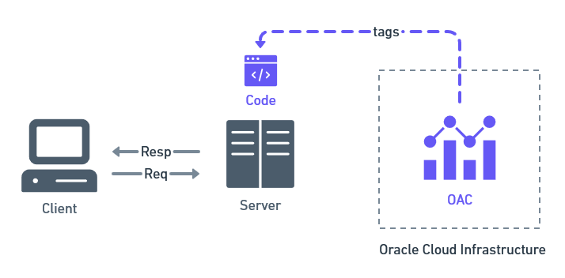
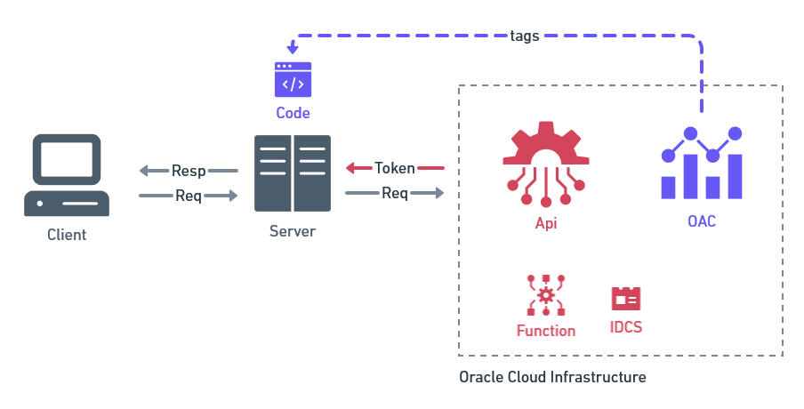

# Oracle Analytics Cloud, Dashboards Públicos.  - Tutorial

En este tutorial embeberemos una instancia de `Oracle Analytics Cloud (OAC)` en una página web para acceder desde cualquier navegador y ver los dashboards públicos. El tutorial estará dividido en tres partes:

## [Parte I - Dashboard Privado](parte-i/README.md)

Iniciaremos con un setup básico de OAC para embeber nuestros dashboards en nuestra página web, los cuales, a este punto serán privados, es decir, requieren de usuario y contraseña para poder verlos.

Esta parte la dividiremos en 3 bloques:

1. Setup del entorno
2. Embeber OAC
3. Dominios seguros en OAC

## [Parte II - Generación de un Token](parte-ii/README.md)

Para hacerlo dividiremos esta segunda parte en 3 bloques:

1. Crear un usuario con pocos privilegios
2. Crear una app con IDCS.
3. Codificar la credencial de nuestra app con Base 64.

## [Parte III - Dashboard Público](parte-iii/README.md)

Luego, agregaremos los componentes en `Oracle Cloud Infrastructure (OCI)` para hacer nuestros dashboards públicos.

1. Oracle Function para crear un Token.
2. Crear un Api gateway para invocar nuestra Funcion.
3. Setup final de la página web.

## Contribuidores

- Elaboración: Pablo Sierra
- Revisado: Jose Ordoñez

## Referencias

- [Oracle Analytics Cloud (OAC) Embedding— Public User Access — Part 1](https://insight2action.medium.com/oracle-analytics-cloud-oac-embedding-public-user-access-part-1-5fb0f513508a)

- [Oracle Analytics Cloud (OAC) Embedding — Public User Access — Part 2](https://insight2action.medium.com/oracle-analytics-cloud-oac-embedding-public-user-access-part-2-cb0c9cdb0d8)
