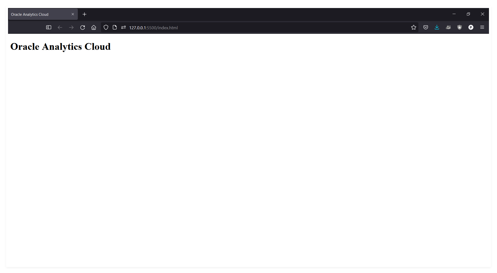

# Parte 1 - Dashboards privados

## a. Setup del entorno

Antes que nada te recomendamos descargar el Visual Studio Code e instalarle la extensión Live Server para hacer las pruebas con una página web local o preparar un entorno similar. Puedes crear una carpeta nueva carpeta `oac` y crear un nuevo archivo llamado `index.html`.

Seguidamente necesitaremos crear una el código de neustra web en donde embeber nuestros dashboards de OAC, en este punto puedes usar tu propia página web o usar el siguiente código html para hacer pruebas:

```html
<!DOCTYPE html>
<html dir="ltr">
    <head>
        <meta http-equiv="Content-Type" content="text/html; charset=utf-8">
        <title>Oracle Analytics Cloud</title>
    </head>
    <body>
        <h1>Oracle Analytics Cloud</h1>
        <div style="position: absolute; width: 100%; height: 100%">
            <!-- dashboards -->
        </div>
    </body>
</html>
```

La estructura es simple y en ella agregaremos los `tags` y `scripts` necesarios para embeber nuestros dashboars.

En esta momento ya podrás dar click derecho al `index.html` y abrilo con el Live Server y se te abrirá una nueva pestaña en tu navegador en donde únicamente veras el título.



## b. Setup de OAC

Debes escoger el proyecto en OAC con el que quieras trabajar, es importante que si tienes quieres que sea compartido, este proyecto debe estar en las `Carpetas Compartidas` en `OAC`.

Luego en tu proyecto de analytics debes hacer click en el menu de los tres puntos que está ubicado a la derecha y seleccionar el modo desarrollador.


Seguidamente desde el menu de desarrollador, escoge la pestaña `embeber` y allí copia el `script` y el `tag`.


Este paso es **¡importante!** en la descripción del `script` notamos que se indica cambiar `<embeddingMode>` por `jet` o `standalone`, entonces, como en nuestra página solo se usará para el dashboard, usaremos la segunda opción:

```html
<script src="https://oac-grgqvoahscvk-gr.analytics.ocp.oraclecloud.com/public/dv/v1/embedding/standalone/embedding.js" type="application/javascript">
</script>

<oracle-dv project-path="/@Catalog/shared/Sample/Sample Project">
</oracle-dv>
```

Luego, volvemos a nuestra página y agregamos el código como corresponde:

```html
<!DOCTYPE html>
<html dir="ltr">
    <head>
        <meta http-equiv="Content-Type" content="text/html; charset=utf-8">
        <title>Oracle Analytics Cloud</title>
    </head>
    <body>
        <h1>Oracle Analytics Cloud</h1>
        <div style="position: absolute; width: 100%; height: 100%">
            <!-- dashboards -->
            <oracle-dv project-path="/@Catalog/shared/Sample/Sample Project"></oracle-dv>
        </div>
    </body>
    <script src="https://oac-grgqvoahscvk-gr.analytics.ocp.oraclecloud.com/public/dv/v1/embedding/standalone/embedding.js" type="application/javascript"></script>
</html>
```

El script que embebimos contiene la función `requirejs` que recibe varios parametros en forma de `array` y una `callback function` y es la que usaremos para renderizar el dashboard en nuestra página web.

```html
<script>
    const params = ['knockout', 'ojs/ojcore', 'ojs/ojknockout', 'ojs/ojcomposite', 'jet-composites/oracle-dv/loader'];
    requirejs(params, ko =>  ko.applyBindings());
</script>
```

Volvemos a nuestro código y agregamos el script de nuestra función y es muy importante que esta se ejecute luego de que el `<oracle-dv></oracle-dv>` se haya cargado completamente por lo que lo agregaremos al final.

```html
<!DOCTYPE html>
<html dir="ltr">
    <head>
        <meta http-equiv="Content-Type" content="text/html; charset=utf-8">
        <title>Oracle Analytics Cloud</title>
    </head>
    <body>
        <h1>Oracle Analytics Cloud</h1>
        <div style="position: absolute; width: 100%; height: 100%">
            <!-- dashboards -->
            <oracle-dv project-path="/@Catalog/shared/Sample/Sample Project"></oracle-dv>
        </div>
    </body>
    <script src="https://oac-grgqvoahscvk-gr.analytics.ocp.oraclecloud.com/public/dv/v1/embedding/standalone/embedding.js" type="application/javascript"></script>
    <script>
        const params = ['knockout', 'ojs/ojcore', 'ojs/ojknockout', 'ojs/ojcomposite', 'jet-composites/oracle-dv/loader'];
        requirejs(params, ko =>  ko.applyBindings());
    </script>
</html>
```

Finalmente, debemos tomar nota de la url nuestro servidor que en este caso es `127.0.0:5500` y [agregarla como un dominio seguro](https://docs.oracle.com/en/cloud/paas/analytics-cloud/acabi/register-safe-domains.html) desde la consola de administración de OAC.


En este momento ya debemos poder acceder a los dashboards desde nuestra página web.


