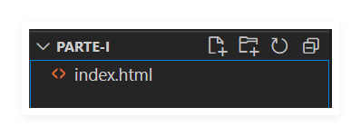
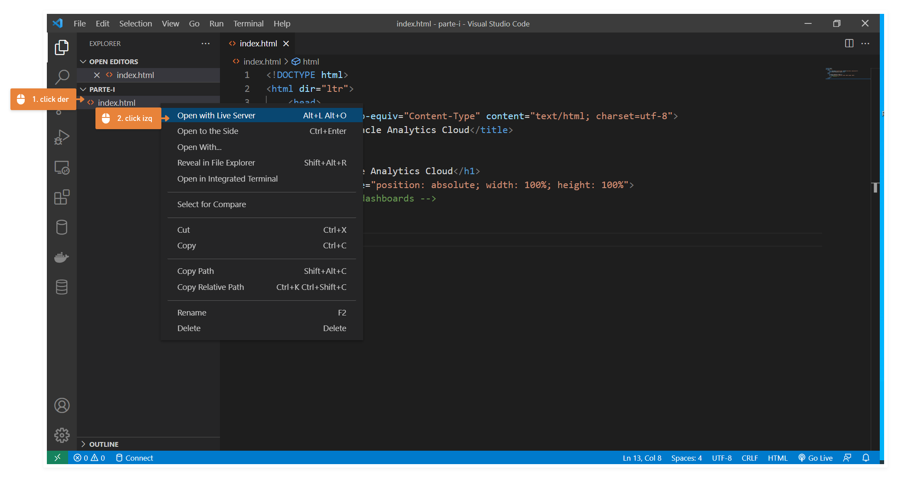
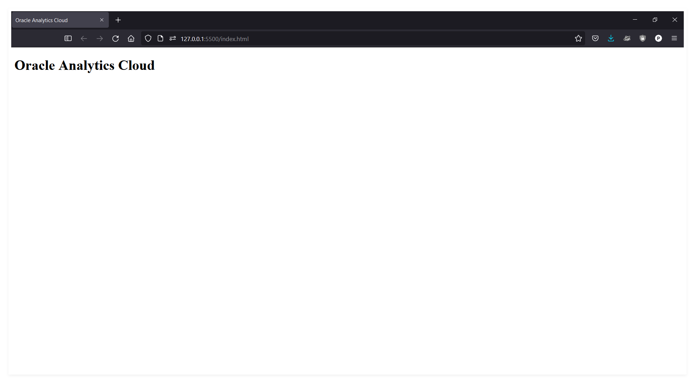
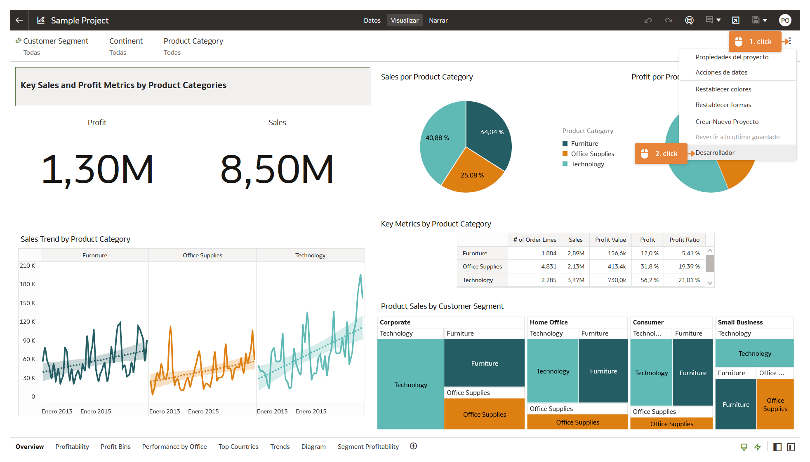
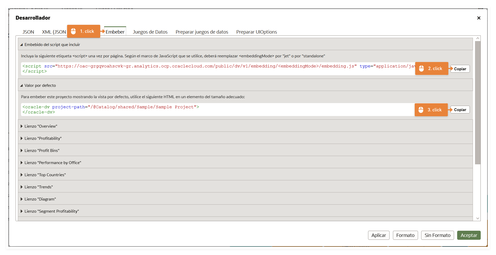
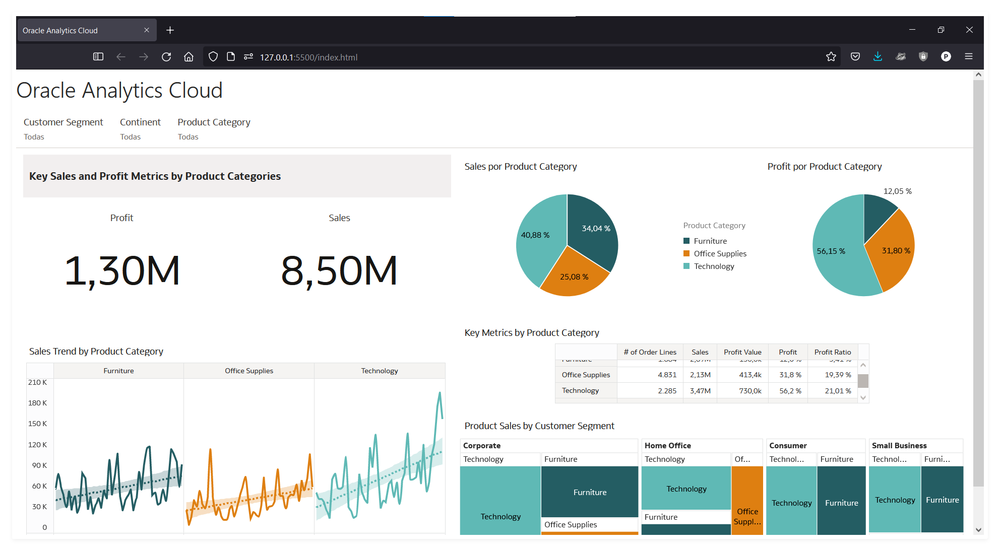

# Parte I - Dashboards privados

## 1. Setup del entorno

Antes que nada te recomendamos descargar el [Visual Studio Code](https://code.visualstudio.com/) e instalarle la extensión [Live Server](https://marketplace.visualstudio.com/items?itemName=ritwickdey.LiveServer) para hacer las pruebas con una página web local o sino entonces debes preparar un entorno similar.

Puedes crear una carpeta nueva carpeta `parte-i` y crear allí un nuevo archivo llamado `index.html`.

)

Seguidamente necesitaremos crear una el código de neustra web en donde embeber nuestros dashboards de OAC, para ello, puedes usar tu propio código o usar el siguiente ejemplo para hacer pruebas:

```html
<!DOCTYPE html>
<html dir="ltr">
    <head>
        <meta http-equiv="Content-Type" content="text/html; charset=utf-8">
        <title>Oracle Analytics Cloud</title>
    </head>
    <body>
        <h1>Oracle Analytics Cloud</h1>
        <div style="position: absolute; width: 100%; height: 100%">
            <!-- dashboards -->
        </div>
    </body>
</html>
```

Verás que la estructura es simple y en ella iremos agregando los `tags` y `scripts` necesarios para embeber nuestros dashboars.

En esta momento puedes hacer una prueba para ver la página web, puedes dar click derecho al `index.html` y abrilo con el Live Server.



Seguidamente se te abrirá una nueva pestaña en tu navegador en donde únicamente veras el título.



## 2. Embeber OAC

Ahora desde el `OAC`, debes escoger el proyecto con el que quieras trabajar, y es muy importante notar que si quieres que el proyecto sea visto por diferentes usuarios, entonces, este debe estar en las `Carpetas Compartidas` en `OAC`.

Luego, dentro de tu proyecto de analytics debes hacer click en el menu de los tres puntos que está ubicado a la derecha y seleccionar el modo desarrollador.



Seguidamente desde el menu de desarrollador, escoge la pestaña `embeber` y allí copia el `script` y el `tag` para pegarlas en nuestro html.



En este paso es **¡importante!** notar que en la descripción del `script` se indica cambiar `<embeddingMode>` por `jet` o `standalone` y como en nuestra página solo se usará para el dashboard, usaremos la segunda opción y lo editaremos:

```html
<script src="https://oac-grgqvoahscvk-gr.analytics.ocp.oraclecloud.com/public/dv/v1/embedding/standalone/embedding.js" type="application/javascript">
</script>
```

Volvemos a nuestra página y agregamos el código como corresponde:

```html
<!DOCTYPE html>
<html dir="ltr">
    <head>
        <meta http-equiv="Content-Type" content="text/html; charset=utf-8">
        <title>Oracle Analytics Cloud</title>
    </head>
    <body>
        <h1>Oracle Analytics Cloud</h1>
        <div style="position: absolute; width: 100%; height: 100%">
            <!-- dashboards -->
            <oracle-dv project-path="/@Catalog/shared/Sample/Sample Project"></oracle-dv>
        </div>
    </body>
    <script src="https://oac-grgqvoahscvk-gr.analytics.ocp.oraclecloud.com/public/dv/v1/embedding/standalone/embedding.js" type="application/javascript"></script>
</html>
```

Así el `<oracle-dv></oracle-dv>` será el lugar donde aparecera nuestro dashboard y el `<script></script>` llamara unas librerías en javascript que renderizaran el contenido.

Con ese script que embebimos podemos invocar a la función `requirejs` que recibe varios parametros en forma de `array` y una `callback function` y es la que usaremos para renderizar el dashboard en nuestra página web.

```html
<script>
    const params = ['knockout', 'ojs/ojcore', 'ojs/ojknockout', 'ojs/ojcomposite', 'jet-composites/oracle-dv/loader'];
    requirejs(params, ko =>  ko.applyBindings());
</script>
```

Nuevamente en nuestro código agregamos este script que invoca a `requirejs`, es muy importante que esta se ejecute luego de que el `<oracle-dv></oracle-dv>` se haya cargado completamente por lo que lo agregaremos al final de nuestro html.

```html
<!DOCTYPE html>
<html dir="ltr">
    <head>
        <meta http-equiv="Content-Type" content="text/html; charset=utf-8">
        <title>Oracle Analytics Cloud</title>
    </head>
    <body>
        <h1>Oracle Analytics Cloud</h1>
        <div style="position: absolute; width: 100%; height: 100%">
            <!-- dashboards -->
            <oracle-dv project-path="/@Catalog/shared/Sample/Sample Project"></oracle-dv>
        </div>
    </body>
    <script src="https://oac-grgqvoahscvk-gr.analytics.ocp.oraclecloud.com/public/dv/v1/embedding/standalone/embedding.js" type="application/javascript"></script>
    <script>
        const params = ['knockout', 'ojs/ojcore', 'ojs/ojknockout', 'ojs/ojcomposite', 'jet-composites/oracle-dv/loader'];
        requirejs(params, ko =>  ko.applyBindings());
    </script>
</html>
```

## 3. Dominios seguros en OAC

Si vemos en nuestro navegador donde esta abierta nuestra página y notamos que aún no se ven los dashboards, y la razón es que debemos configurar los dominios seguros en OAC.

Para hacerlo debemos tomar nota de la url que nos da nuestro servidor que en neustro caso es el `Live Server` y es `127.0.0.1:5500` y debemos [agregarla como un dominio seguro](https://docs.oracle.com/en/cloud/paas/analytics-cloud/acabi/register-safe-domains.html) desde la consola de administración de OAC tildando los checks de `Conectar` y `Embebido`.


Finalmente, refrescamos nuestro navegador, nos saldra una ventana que nos pedirá autenticarno y luego debemos ver los dashboards embebidos en nuestra página web.


