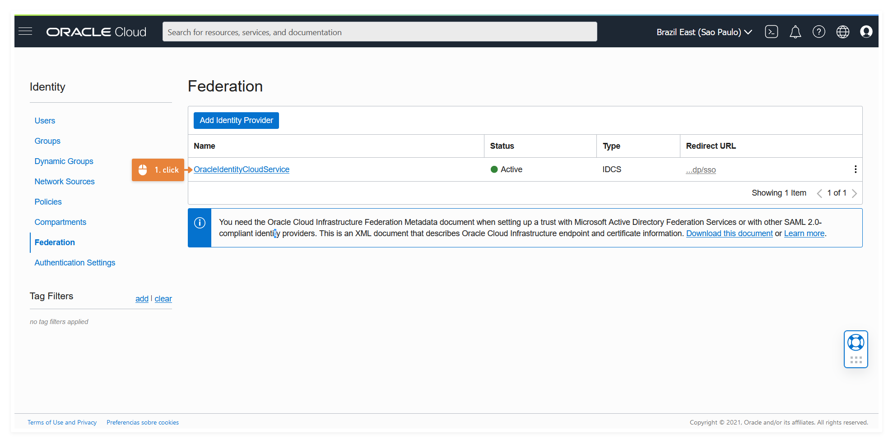

# Parte 2 - Dashboards Públicos

Por defecto `Oracle Analytics Cloud (OAC)` usa una capa de autentificación provista por el `Oracle Identity Cloud Service (IDCS)` y siempre se requiere de autentificación.

Entonces, para disponibilizar contenido público utilizaremos capacidades nativas en la nube que agreguen esta funcionalidad.

Para implementar esta arquitectura se necesitan crear y/o configurar los siguientes componentes:

- Usuario
- App en OIDCS
- Oracle Functions
- Oracle API

## 1. Crear un usuario con pocos privilegios

Para ello debes tener acceso a la consola de Oracle Cloud y buscar en ese orden:

- Menu(Arr. Izquierda) > Identity & Security > Federation

Luego selecciona el proveedor de Identidad que por defecto es `OracleIdentityCloudService (OICS)`.

Allí pulsa el boton crear y verás la siguiente pantalla:

Como puedes ver el usuario que estamos creando es federado, es decir, es un usuario IDCS y solo debes completar los datos minimos requeridos, por lo tanto, luego de hacer click en el boton `create` en la siguiente ventana haz nuevamente click en el boton `close`.

En mi caso el usuario se llama `oac` y para definir la contraseña debes revisar un nuevo mensaje que te habrá llegado al correo que escogiste.

## 2. Crear una app con IDCS.

El siguiente paso será crear una aplicacion para utilizarla como un mecanismo que nos permita la opción de autentificación vía token.

Para ello desde la misma ventana donde creaste tu usuario federado, ahora debes hacer click en el link que te lleva al panel de administrador de OIDCS.

Luego desde la ventana de administración debes seleccionar el icono que está arriba a la izquierda y seleccionar `Applications`.

Selecciona crear una App Confidencial:

En el **1-Details** Selecciona un nombre válido para tu aplicación y dale `next`.

En **2-Client** debes seleccionar `configure this application as a client now` dar permisos como `Resource Owner` y en las políticas de Token seleccionar `Specific` y también dar click en `Add Scope`.

Y en el scope debes buscar tu instancia de OAC, que debe iniciar con `ANALYTICSINST_` más el nombre de tu instancia.

Y así tu instancia quedará registrada:

**Atención** el `Resource` y el `Scope` son datos sensibles y no debes exponerlos públicamente.

Luego, en el **4-Web Tier Policy** solo debes dar en Next.

Y en el **5-Authorization** tampoco debes seleccionar nada y solo haz click en finalizar.

Finalmente te aparecerá una ventana con el `Client ID` y el `Client Secret`.

Estos dos valores son datos que no debes exponer públicamente y debes copiarlos y guardarlos en un lugar seguro antes de cerrar la ventana.

## 3. Codificar la credencial de nuestra app con Base 64

## 4. Oracle Function para crear un Token

## 5. Crear un Api gateway para invocar nuestra Funcion

## 6. Setup final de la página web