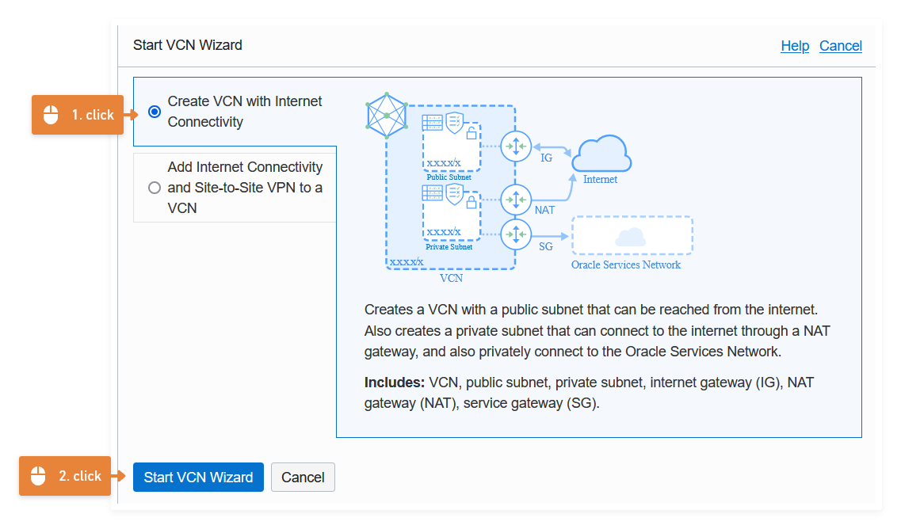
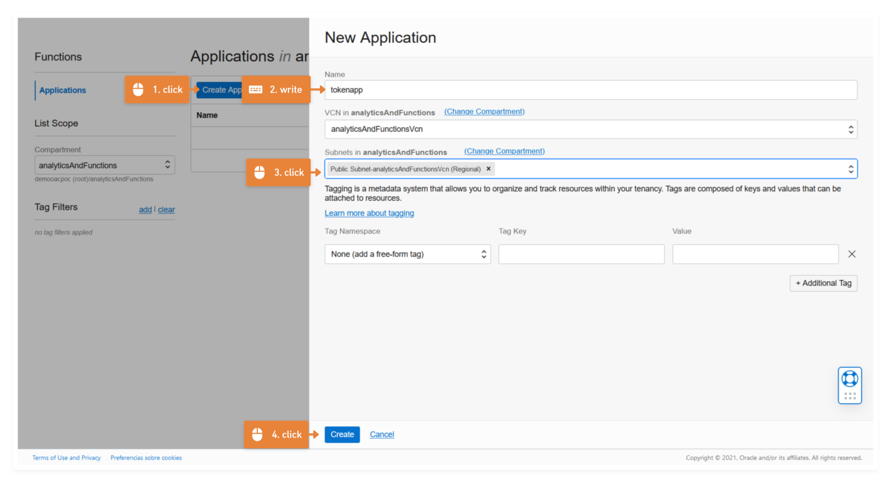

# Automatizar el Token

En esta ultima parte vamos a automatizar la generación del token usando Oracle Functions. Y como requisito previo debemos tener un `compartment` y una `Virtual Cloud Network (VCN)` en la cual trabajar. Si ya tienes esos componentes definidos puedes ir directo al paso 1.

## 0. Setup del compartment y VCN en OCI

Primero, el compartment o compartimiento en español, es simplemente una forma de agrupar nuestros recursos en la nube, ya que desta forma podremos auditar y administrar nuestros recursos. Debes ir a:


Allí a partir del `compartment root` debes crear un nuevo compartment que en este caso se llama `analytics`.


Luego debes ir a crear la VCN:


Asegurate de estar en el compartment correcto `Analytics` y puedes usar el `wizard` para crear rápidamente una VCN.


Deja las opciones por defecto e inicia el wizzard en el cual solo debes llenar el campo `VCN name` con el nombre de tu preferencia y que nosotros llamaremos `functionsvcn`



Dejando los demás parámetros por defecto puedes dar click en siguiente y crear.

## 1. Oracle Function para crear un Token

Debemos ir a functions desde la consola de OCI:


Allí debes crear una applicación y verificar que nosotros llamaremos `apptoken` y dentro de ella crearemos la función que creará nuestro token y la posicionaremos en la subnet pública de la vcn.



Este paso debes puedes seguir el paso a paso del `Cloud Shell Setup`, tomando en cuenta que:

```shell
fn list contextfn list context
fn use context sa-saopaulo-1
fn update context oracle.compartment-id ocid1.compartment.oc1..aaaaaaaagdzkgwhhrk7ysjfoyi7pz7eygs4rqrqjfccye6zc667rd6rl5bra
#cambia el valor de [OCIR-REPO] arbitrariamente
fn update context registry gru.ocir.io/grgqvoahscvk/oactoken
# usaremos node & el nombre sera oacfunction  
fn init --runtime node oacfunction
cd oacfunction
fn -v deploy --app apptoken
fn invoke apptoken oacfunction
```

En el código anterior lo que hacemos es usa `nodejs` como lenguaje de programación y creamos una función llamada `oacfunction` y luego hacemos el deploy, en ese sentido debiste ver un `{"message":"Hello World"}` que se mostró en la pantalla de la consola.

Si en este momento desde la consola usas el comando `ls` veras que se crearon tres archivos dentro de `oacfunction`:

- func.js
- func.yaml  
- package.json

En el `func.js` estará nuestra el código de nuestra función en el `package.json` estarán las dependencias para que nuestro codigo funciones y el `func.yaml` estaran unos parámetros que `fn` usa para dockerizar nuestra función.

Si sabes usar `vi` puedes usar el comando `vi funct.js` y verás el siguiente código:

```javascript
const fdk=require('@fnproject/fdk');

fdk.handle(function(input){
  let name = 'World';
  if (input.name) {
    name = input.name;
  }
  console.log('\nInside Node Hello World function')
  return {'message': 'Hello ' + name}
})
```

Y ese fue el código que se ejecutó cuando lanzamos el comando `fn invoke apptoken oacfunction`, entonces, lo que haremos será sobreescribir ese código para que nos cree un token.

**nota** si no sabes usar `vi` (:c) puedes crear un archivo local en tu pc que se llame `func.js` y luego cargarlo con la opción de la consola. Debes tomar en cuenta que el archivo se cargara en el root por lo que debes moverte usando el comando `..` y luego usar el `mv` para mover el archivo dentro de la carpeta `oacfunction`.


Luego el código base que usaremos será:

```javascript
// This is SAMPLE CODE illustrating how to obtain a token from IDCS using Oracle Functions service
const fdk=require('@fnproject/fdk');
const fetch = require('node-fetch');

fdk.handle(async function(){
    var url ='<URL TO IDCS INSTANCE>';
    var headers = {
        "Content-Type": "application/x-www-form-urlencoded;charset=UTF-8",
        "authorization": "Basic <base64 encoded client ID:Client secret>"
    };

    let details = {
        "grant_type": "password",
        "username": "<username>",
        "password": "<password>",
        "scope": "<scope from IDCS confidential application>"
    };
    let formBody = [];
    
    for (let property in details) {
        let encodedKey = encodeURIComponent(property);
        let encodedValue = encodeURIComponent(details[property]);
        formBody.push(encodedKey + "=" + encodedValue);
        console.log(formBody);
    };

    formBody = formBody.join("&");
    console.log(formBody);
    const response = await fetch(url, { method: 'POST', headers: headers, body: formBody});
    const data = response.json();
    
    return data;
});
```

Debes editar los parametros `url`, `headers` y `details` con los mismos datos que usaste para generar el token desde la consola.

También debes actualizar el `package.json` con las siguientes dependencias:

```json
{
    "name": "oacfunction",
    "version": "1.0.0",
        "description": "Token function",
        "main": "oacfunction.js",
        "author": "",
        "license": "Apache-2.0",
        "dependencies": {
                "@fnproject/fdk": ">=0.0.26",
                "compat": "^1.0.4",
                "cookies": "^0.8.0",
                "extend": "^3.0.2",
                "http-signature": "^1.3.2",
                "node-fetch":"^2.6.0"
        }
}
```

Si tienes dudas, puedes ver un [ejemplo del código](parte-iii\functions) y cuando termines de actualizar los dos archivos
debes hacer un nuevo deploy:

```shell
fn -v deploy --app apptoken
```

Y si vuelves a invocar a la función `fn invoke apptoken oacfunction` recibirás el token.

## 2. Crear un Api gateway para invocar nuestra Funcion

## 3. Setup final de la página web